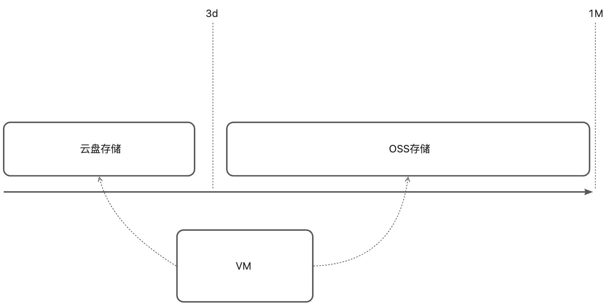
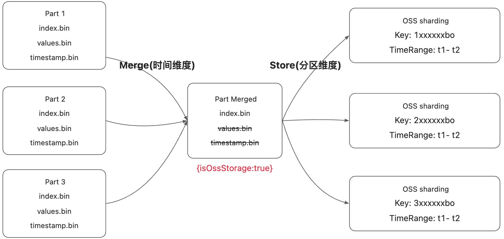
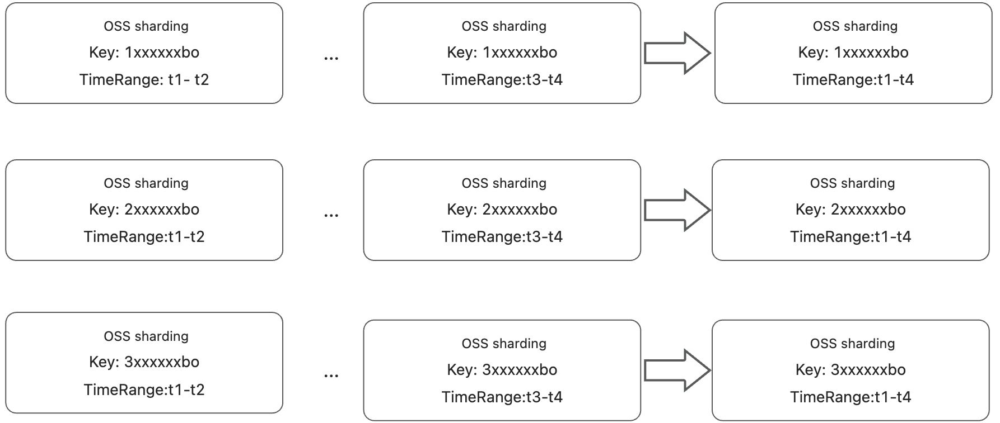
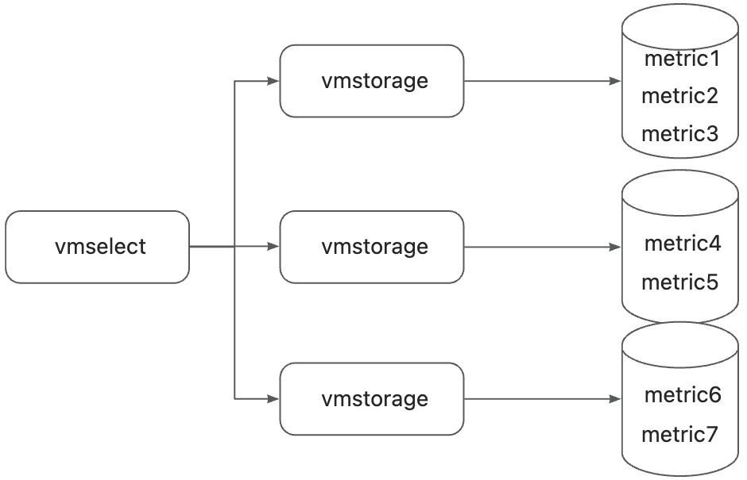
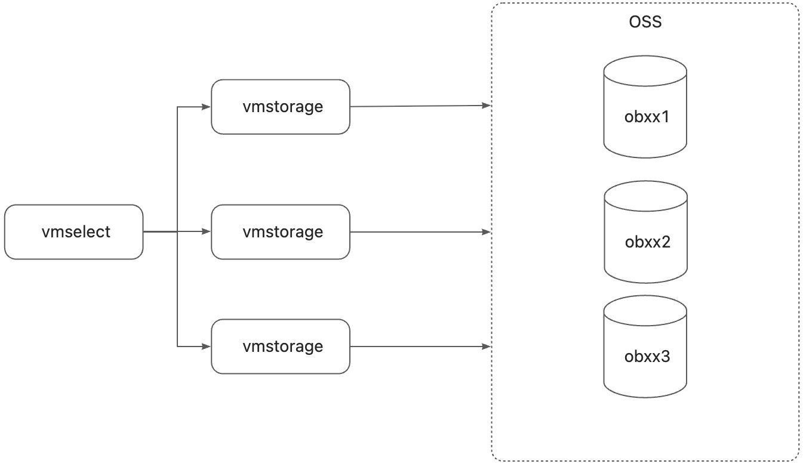
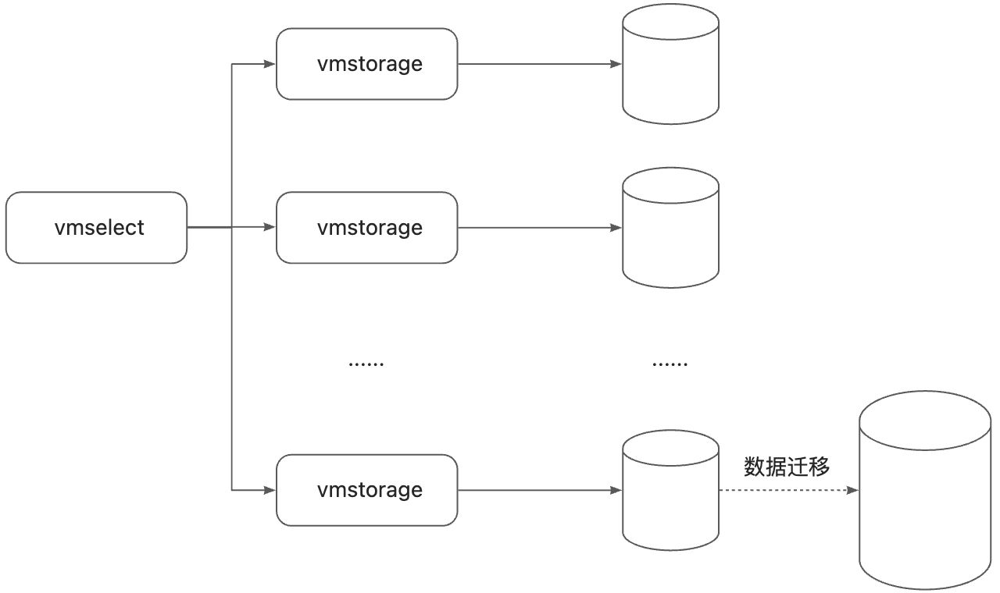
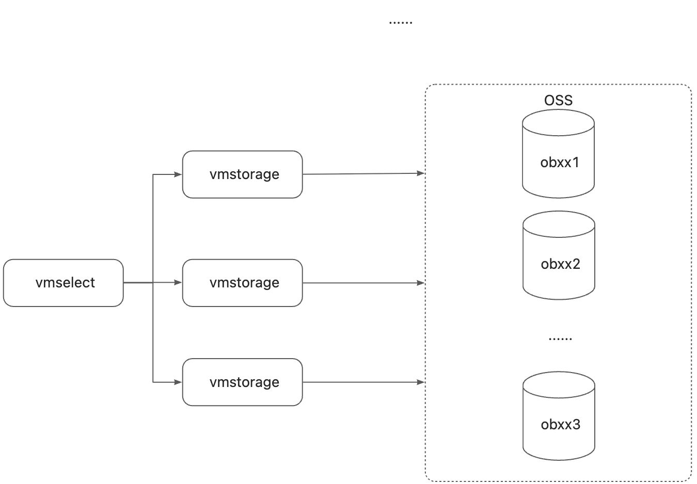
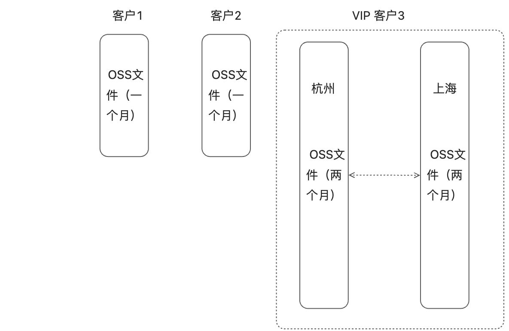

# 背景
目前我们使用的是victoriametrics的开源版，基础功能够用，我们平时过程中发现了一些痛点。


1. <font style="background-color:#E7E9E8;">成本控制</font>

victoriametrics目前只能使用云盘作为存储，通过数据选择性删除和实现基于OSS的存储，可以有效的降低存储成本。

功能列表中的前三项都是为了成本控制的。


2. <font style="background-color:#E7E9E8;">实时告警</font>

目前故障的检测只能依靠promql的定时查询去弄，比如两分钟去查询一次，那么距离真正问题的发生可能已经过去了两分钟，存在时间差。功能列表里面的「物化视图」和「实时告警」两节就是为了解决这个事情的。


所以下面我们基于victoriaMetrics开源版源码做了一些定制化的开发，扩充了相关的功能。

# 功能列表
## 基于过滤表达式的数据过期
### 产品设计
目前我们是把所有的数据放在同一个实例上，但不是所有的数据都是同一个过期时间。比如有些指标仅仅是用来进行告警的，并不需要图表的展示，这些数据就可以三天过期，而需要进行图表展示的指标数据就可以一个月过期，精细化所有数据的过期时间之后，可以更好的控制我们的存储成本。


由于vm的企业版提供了这个功能，并提供了相应的接口文档，我这里直接沿用了vm企业版的设计。

[How vmstorage Processes Data: Retention, Merging, Deduplication,...](https://victoriametrics.com/blog/vmstorage-retention-merging-deduplication/index.html#retention-filters-and-downsampling-enterprise-plan)


关键内容摘抄如下


> If you’re on the [<font style="color:rgb(3, 123, 179);background-color:rgb(0, 0, 0);">Enterprise</font>](https://victoriametrics.com/products/enterprise/) plan, you get more flexibility with retention filters. These let you define retention periods for specific types of data based on criteria like labels.
>
> Enable text wrapping
>

```bash
-retentionFilter='{team="juniors"}:3d' -retentionFilter='{env=~"dev|staging"}:30d' -retentionPeriod=1y
```

> For example:
>
> + Data labeled `<font style="color:rgb(199, 60, 0);background-color:rgba(0, 0, 0, 0.04);">team="juniors"</font>` could have a 3-day retention.
> + Data labeled `<font style="color:rgb(199, 60, 0);background-color:rgba(0, 0, 0, 0.04);">env=~"dev|staging"</font>` could have a 30-day retention.
> + Everything else could have a 1-year retention.
>


简而言之，通过过滤器来来筛选需要进行特殊指标的控制，来实现精细化控制存储成本的目的。


### 技术实现


1. 判断是否达到了合并条件，这里不会判断过滤表达式，因为在分区数据级别是拿不到指标元数据的。

```go
func isAvailable(pw *partWrapper) bool {
	if pw.mp != nil {
		return false
	}
	rdurations := GetRetentionFilter()
	ddurations := GetDownSamplingPeriod()
	duration := append(rdurations, ddurations...)
	for _, duration := range duration {
		at := pw.p.indexFile.(*fs.ReaderAt)
		neverDoIt := at.GetModTime().UnixMilli()-pw.p.ph.MaxTimestamp < duration.Period.Milliseconds()
		timeOut := time.Now().UnixMilli()-pw.p.ph.MaxTimestamp > duration.Period.Milliseconds()
		result := neverDoIt && timeOut
		return result
	}
	return false
}
```

这里通过合并之后的文件的创建时间来判断是否已经合并过（neverDoIt），并且通过当前时间来判断是否数据已经过期（timeOut），这样就能保证当数据过期的时候能够触发，当合并完成之后不会重复触发（因为neverDoIt的条件已经不成立了）


2. 循环遍历每个block的时候，判断过滤表达式，如果命中了则在合并的时候过滤该数据

```go
if isRetentionFilterAvailable(s, b) {
    localRowsDeleted += uint64(b.bh.RowsCount)
    logger.Infof("isRetentionFilterAvailable target, MetricID = %d", b.bh.TSID.MetricID)
    continue
}


func isRetentionFilterAvailable(s *Storage, b *Block) bool {
	durations := GetRetentionFilter()
	for _, duration := range durations {
		filters := duration.Tfs
		tr := TimeRange{
			MinTimestamp: b.bh.MinTimestamp,
			MaxTimestamp: b.bh.MaxTimestamp,
		}
		if !s.ContainsMetricId(filters, tr, b.bh.TSID.MetricID) {
			return false
		}
		period := duration.Period
		return (time.Now().UnixMilli() - b.bh.MaxTimestamp) > period.Milliseconds()
	}
	return false
}

```


## 基于过滤表达式的降采样


### 产品设计
基于跟上面同样的目的，有些数据其实不需要保存的那么密，对于比较久远的数据，可以降采样保存。

该功能同样存在于vm企业版，这里仍然沿用vm企业版的产品设计，关键内容摘抄如下


> And then there’s downsampling, which is a lifesaver for managing high volumes of older data. Older data doesn’t get queried as often as recent data, so storing every single sample forever isn’t practical. Downsampling reduces the number of samples stored by keeping just one sample per time interval for older data.
>
> Line wrapping: OFF
>

```bash
-downsampling.period=30d:5m
```

> In this example:
>
> + For data older than 30 days, the system keeps only the last sample for every 5-minute interval, dropping the rest.
> + For data older than 180 days, the system keeps only the last sample for every hour.
>
> You can combine these rules for multi-level downsampling, applying different levels of granularity as data ages. On top of that, you can even set up downsampling for specific time series using filters, just like retention filters:
>
> Line wrapping: OFF
>

```bash
-downsampling.period='{__name__=~"(node|process)_.*"}:30d:1m'
```

> This snippet tells VictoriaMetrics to downsample data points older than 30 days to one-minute intervals, but only for time series with names that start with the `node_` or `process_` prefixes.
>

<font style="color:rgb(3, 123, 179);background-color:rgb(0, 0, 0);"></font>

<font style="color:rgb(3, 123, 179);background-color:rgb(0, 0, 0);">  
</font>

### 技术实现


前两步和上一节的类似，只是第三步的时候有些差异

```go
available, duration := isDownSamplingAvailable(s, pendingBlock)
if available {
    downSampling(pendingBlock, duration)
}

func downSampling(block *Block, downSamplingRate time.Duration) {
	var ts []int64
	var va []int64
	timestamps := block.timestamps
	values := block.values
	if len(timestamps) == 0 {
		return
	}
	var time_ = timestamps[0]
	ts = append(ts, timestamps[0])
	va = append(va, values[0])

	for i := 1; i < len(timestamps); i++ {
		if timestamps[i] > time_+downSamplingRate.Milliseconds() {
			ts = append(ts, timestamps[i])
			va = append(va, values[i])
			time_ = timestamps[i]
		}
	}
	block.timestamps = ts
	block.values = va
	logger.Infof("downSampling: MetricID=%v", block.bh.TSID.MetricID)
}

```


## 基于对象存储的过期存放策略
### 产品设计
目前vm的数据都是存放在云盘上的，云盘存储数据的成本相对较高，但是我们的数据存放了一个月，对于后面的冷数据，访问量很低，放在云盘上是很不划算的，需要迁移到对应的oss


参照上面retentionFilter的设计，定义了如下的参数

```bash
-objectStorageFilter='{team="juniors"}:3d' -objectStorageFilter='{env=~"dev|staging"}:1d' -objectStoragePeriod=7d
```


其中objectStoragePeriod定义了基本的对象储存周期，即7天以后数据开始存储到对象存储中，objectStorageFilter定义了对应的过滤表达式，对于满足条件的时序指标设定特定的阈值。


对于存放在对象存储的文件，涉及到数据分区，通过下面的参数来定义分区Key，下面的意思是指标先通过ob_cluster_name进行分区，如果不存在则通过obproxy_cluster进行分区。数据分区可以很好的进行数据读写的平衡，避免数据都集中某几台机器上。

objectStorageShardingKeyRule表示key的规则，reverse表示key的值需要反过来一下，具体原因后面说

```bash
-objectStorageShardingKeys='ob_cluster_name,obproxy_cluster'
-objectStorageShardingKeyRule=reverse
```


同时另外需要定义一些对应实现的参数，比如对应云服务提供商对应的对象存储region，endpoint，bucketName，ak以及sk等。

| | (0-3d) | (3d-1M) |
| --- | --- | --- |
| 存储类型 | 云盘存储 | 对象存储 |
| Sharding 类型 | 按照metric进行分区 | 按照业务集群进行分区 |
| 适用场景 | 偏重于巡检等需要查询全量数据的场景 | 偏重于图表等需要查询特定集群数据的场景 |
| 费用 | 昂贵 | 便宜 |
| 速度 | 非常快 | 比较快 |
| 访问频率 | 频繁 | 很少 |
| 存储容量扩展性 | 需要重新购买机器，进行数据迁移，很麻烦 | 线性扩展 |




### 技术实现


#### 忽略timestamp.bin的存储策略


上面是线上某个region下时间跨度长达15天的数据详情，这里可以看到timestamps.bin（存放指标的时间戳的数据）和values.bin（存放指标的值的数据）占了存储的绝大部份，所以对象存储要解决的也就是这两个文件，其他的几个文件可以忽略。


index.bin里面保存着对应values.bin和timestamps.bin文件里面的offset以及对应的block size，转存到对象存储之后，正好从index.bin读出来的数据就是读取对象存储范围查询的参数。


这里正好可以实施一个trick，我们只保存values.bin数据，完全的不去管timestamps.bin数据。在将这个细节之前，我先介绍一些timestamps.bin对应的压缩算法。

```go
1750065291000
1750065292000
1750065293000
1750065294000
1750065295000
```

对于上面这个时间戳数据，如果我们想要对其进行压缩，很容易想到这个方法――我只保存第一个值，剩下的值我只存储之间的差值即可，这样我们的存储就会小很多

```go
1750065291000
1000
2000
3000
4000
5000
```


其实上面的数据仔细想想还是有优化空间的，因为他们都是均匀的步长前进的，所以可以在第二个点记录步长，剩下的记录步长的变化率即可

```go
1750065291000
1000
0
0
0
0
```


这个算法就是`Delta of Delta`，也是vm，prometheus等时序存储普遍采用的压缩算法，但是这种算法节省空间是有一个前提的，那就是――上报的时序数据必须是等间隔的，如果没有任何规律的话，则不一定比前一种方法省空间多少。


那么现在关于时间戳存储还有没有什么可以优化的空间呢，有的，如果可以延续上面等时间间隔的设定，那么整个时间序列我都是可以不去存储的，反正只要记录好了第一个时间戳和步长，后面的数据都是0嘛，有什么好存的。当然，这样做需要有一定使用上的折损，那就是只能查询特定时间点的数据，但是这些数据本就是冷数据，给予这种精度上的缺失其实是可以接受的。


比如，原始的数据可能是这样的

```go
timestamp-> value 
1750065291000-> 1
1750065291100-> 1 //并非最近点数据，直接忽略
1750065291900-> 3
1750065293001-> 4 //并非最近点数据，直接忽略
1750065294000-> 2
1750065294800-> 5
```

假设步长为1000ms，那么调整之后的数据为

```go
timestamp-> value 
1750065291000-> 1
1750065292000-> 3
1750065293000-> NaN  //由于数据缺失直接补上NaN
1750065294000-> 2
1750065295000-> 5
```


这样在读取时候的逻辑也需要完成相应的改造，读完values.bin的数据之后，同样可以根据这种规则构造出timestamp.bin。这样我们就生下来了timestamp.bin的存储成本，这个改造的意义并不是节省一点存储成本那么简单，而是在查询请求的时候，减少了一次IO操作，这样整体的查询RT也会快很多。


#### 数据分区
关于数据分区的意义，阿里云的oss帮助文档给了一个解释

[OSS性能最佳实践_对象存储(OSS)-阿里云帮助中心](https://help.aliyun.com/zh/oss/use-cases/oss-performance-best-practices?spm=a2c4g.11174283.help-menu-31815.d_6_13.1f982842jqVV3W#section-wdc-5ln-vdb)


里面推荐文件名采用如下的模式

```bash
sample-bucket-01/9b11/2024-07-19/customer-1/file1
sample-bucket-01/9fc2/2024-07-19/customer-2/file2
sample-bucket-01/d1b3/2024-07-19/customer-3/file3
...
sample-bucket-01/9fc2/2024-07-20/customer-2/file4
sample-bucket-01/f1ed/2024-07-20/customer-5/file5
sample-bucket-01/0ddc/2024-07-20/customer-7/file6
```

在bucketName下面的第一级目录尽量打散，但是我们的集群名字都是ob开头的，集群末尾的几个字母是随机的，这个时候反转的话数据分布就会比较随机了，到时候文件类似如下，key都是以bo结尾了。

```bash
vm-bucket/6ukb8ebwcy75bo/xxxxxx0-values.bin
vm-bucket/6ukb8ebwcy75bo/xxxxxx1-values.bin
vm-bucket/6u6tpfc57nbo/xxxxxx2-values.bin
```


xxxxxx0就是一次merge的mergeId，上一节里面的就是一个mergeid，不管是读取和存储value.bin，都是可以访问mergeId的，这样就可以轻松的定位到我们对应的对象存储文件了。

定位到了文件，如何读取到我们想要的内容呢，对象存储都是支持范围查询的，以阿里云的OSS为例

> <font style="color:rgb(24, 24, 24);">当下载OSS中的大文件（大于100 MB）时，由于网络环境不稳定可能导致传输中断。如果您只需要下载文件的部分内容，而不是下载完整文件的情况下，可以使用HTTP Range请求获取文件的部分内容。请求方法说明如下：</font>
>

<font style="color:rgb(24, 24, 24);background-color:rgb(244, 247, 250);"> </font>

```javascript
Get /ObjectName HTTP/1.1
Host:examplebucket.oss-cn-hangzhou.aliyuncs.com
Date:Fri, 19 Jul 2024 17:27:45 GMT
Authorization:SignatureValue
Range:bytes=[$ByteRange]
```

> <font style="color:rgb(24, 24, 24);">根据HTTP协议规范，Range请求头允许客户端指定希望接收的数据片段有效区间位于0至</font>`<font style="color:rgb(24, 24, 24);background-color:rgba(0, 0, 0, 0.04);">content-length - 1</font>`<font style="color:rgb(24, 24, 24);">的范围内。关于通过HTTP Range请求分段获取OSS资源的更多示例，请参见</font>[<font style="color:rgb(19, 102, 236);">如何通过HTTP Range请求分段获取OSS资源</font>](https://help.aliyun.com/zh/oss/how-to-obtain-oss-resources-by-segmenting-http-range-requests)<font style="color:rgb(24, 24, 24);">。</font>
>


```bash
	// 创建获取对象的请求
	request := &oss.GetObjectRequest{
		Bucket:        oss.Ptr(bucketName),     // 存储空间名称
		Key:           oss.Ptr(objectName),     // 对象名称
		Range:         oss.Ptr("bytes=15-35"), // 指定下载范围
		RangeBehavior: oss.Ptr("standard"),     // 指定标准行为范围下载
	}

```

<font style="color:rgb(24, 24, 24);"></font>

<font style="color:rgb(24, 24, 24);">所以接下来的事情就是确定文件的offsize和size，这里再贴一下之前的文件结构图</font>

<font style="color:rgb(24, 24, 24);"></font>

<font style="color:rgb(24, 24, 24);">index.bin的结构参见代码</font>

<font style="color:rgb(24, 24, 24);"></font>

```go
// blockHeader is a header for a time series block.
//
// Each block contains rows for a single time series. Rows are sorted
// by timestamp.
//
// A single time series may span multiple blocks.
type blockHeader struct {
    // TSID is the TSID for the block.
    // Multiple blocks may have the same TSID.
    TSID TSID

    // MinTimestamp is the minimum timestamp in the block.
    //
    // This is the first timestamp, since rows are sorted by timestamps.
    MinTimestamp int64

    // MaxTimestamp is the maximum timestamp in the block.
    //
    // This is the last timestamp, since rows are sorted by timestamps.
    MaxTimestamp int64

    // FirstValue is the first value in the block.
    //
    // It is stored here for better compression level, since usually
    // the first value significantly differs from subsequent values
    // which may be delta-encoded.
    FirstValue int64

    // TimestampsBlockOffset is the offset in bytes for a block
    // with timestamps in timestamps file.
    TimestampsBlockOffset uint64

    // ValuesBlockOffset is the offset in bytes for a block with values
    // in values file.
    ValuesBlockOffset uint64

    // TimestampsBlocksSize is the size in bytes for a block with timestamps.
    TimestampsBlockSize uint32

    // ValuesBlockSize is the size in bytes for a block with values.
    ValuesBlockSize uint32

    //...
}

```


这里保存了ValuesBlockOffset和ValuesBlockSize这两个参数读取出来就可以拿到对应oss文件了，IO操作只有一次。同时里面还有MinTimestamp，拿到这个值之后，就可以在内存里面构建出timestamp数组，后面的逻辑就完全的适配了，改动可控。


#### 基于OSS的合并新流程
1. 原本的vm的分区都是时间维度的，存放到OSS之后，被水平拆分到各个sharding中去了，每个sharding的timerange是相同的。




2. 同一个sharding的不同时间范围的文件做sharding内部的合并。




每个以集群名命名的文件夹下都会有类似如下的文件，而且文件名都一样，都是形如mergeId-values.bin的格式。


上述一个part的具体详情如下，可以看到timestamps.bin和values.bin都是空的，同时metadtat.json里面的IsObjectStorage为true，表示该part为对象存储，需要去远程获取文件。


## 物化视图
### 产品设计
比如，我们想查询节点的CPU使用率的时候会使用如下的promql

```go
100 * (1 - rate(node_cpu_seconds_total{mode="idle",ob_cluster_name!="", type!="pod"}[3m]) 
/ on(ob_cluster_name, host_name,svr_ip) sum(rate(node_cpu_seconds_total{ob_cluster_name!="", type!="pod"}[3m])) 
       by (ob_cluster_name, host_name, svr_ip))
```

这个promql太复杂了，不管是巡检还是图表都是用的这个promql，会给系统带来很大的压力。这个时候就可以换个思路，在指标存储的时候就直接将这个promql的结果存储下来，这样，后续的查询都只查这个视图就可以了，可以给系统节省很大的负载。


物化视图并不会增加系统的存储成本的，还记得之前提到的「基于过滤表达式的数据过期」吗？node_cpu_seconds_total这个指标的过期时间可以的很短，同时视图的存储量肯定是小于原先node_cpu_seconds_total之和的。


对于数据库TP/AP产品来说，物化视图通常有实时物化视图和延迟物化视图，我们这边暂时只支持实时物化视图。

### 技术实现
## 实时告警
### 产品设计
目前的告警都是定时的查询，比如五分钟一次，一般到了一分钟一次就是极限了，如果再继续往下，查询的请求也会进行挤压，所以按照目前的架构来说告警的延迟是一件确定的事情。


1. <font style="background-color:#E7E9E8;">基本阈值的巡检告警条件</font>

同时，对于大部分的告警来说，都是基本的阈值判断，比如下面的这种方式

node_load > 98


这种简单的模式，占了告警的80%以上，这种告警就可以很好的用实时告警的进行取代，在数据插入的时候只需要做简单的条件判断，就可以发出告警，真正做到无延迟的实时告警。


2. <font style="background-color:#E7E9E8;">Agent对应的改造</font>

对于如下的promql，无法简单的通过阈值判断来进行快速的实时告警。

```go
100*sum by(ob_cluster_name,svr_ip,ob_tenant_id) (ob_tenant_context_memory_hold_bytes{ctx_name!="KVSTORE_CACHE_ID"})
/on (ob_cluster_name,svr_ip, ob_tenant_id) (last_over_time(ob_m_mem_tenant_base_limit_size[2h])) > 90
```


对于实时告警来说，是很难处理类似于sum，count等基于同一时间戳聚合函数，是无法在vm侧在内存层面做聚合，这是因为vm无法判断数据是否到齐，如果严格的做这件事情需要引入类似于flink的watermark等机制，这就太麻烦了。


所以比较合理的做法就是Agent直接在采集侧就直接算好整个内存使用率的值，vm在数据生成的时候直接告警。


3. <font style="background-color:#E7E9E8;">基于物化视图的实时告警</font>

基于sum和count这类基于同一时间维度的计算可以扔给agent来代劳了，但是基于时间维度的聚合是无法让agent来弄的，因为过往的数据agent是不会保存的，而vm在内存中是保存了之前的数据的，所以可以很方便的计算出跟之前指标的差异。


比如还是之前的例子

```go
rate(node_load{mode="idle",ob_cluster_name!="", type!="pod"}[3m]) 
```


node_load，这是一个counter指标，意味着agent上报的这个指标是一直增长的。那么定义我们的物化视图名为node_load_delta_1m，delta表示为相对于之前值的差异值，1m表示该指标表示的是跟之前一分钟的指标的差值，在实际操作上，一般取最近点的差值，如果不足一分钟则乘以相应的倍数。node_load_total在11:00:00的时候是100，在11:00:15的时候是103，则在11:00:15的时候node_load_delta_1m为3 * 4= 12，直接就可以得到cpu使用率了，不用再通过复杂的运算了，也就可以使用实时告警了。


4. <font style="background-color:#E7E9E8;">本地聚合指标判断</font>

<font style="background-color:#E7E9E8;"></font>

为了精细化的控制告警条件，之前在promql之后还有一层基于springEL的表达式条件，比如min() > 7, max() >= 10 这种。在迁移到实时告警这里，对于max() > 10 或者 min() < 5 这种「敏感性」条件来说是很简单的，只要触发一次就告警出来。


但是对于max() < 10 或者 min() > 5这种「宽容性」条件来说就比较复杂了，需要建立对应的滑动窗口，只要出现了不符合条件的数据，则滑动窗口清零，如果滑动窗口的长度达到了预定的长度，则进行告警。


由于即使一次数据异常也是非常罕见的，所以上述操作对于内存的占用其实是不大的。


# 运维需求
## 性能分析
vmstorage目前的sharding策略是基于metricName来的，就是某个指标只会存在一台vmstorage机器上，对于一些比较大的指标（比如ob_stat）会存在严重的数据倾斜问题。同时由于热点可能集中于某几个指标，导致流量分布极不均衡以及IO的不均衡。





VM增强版在转储数据的时候会将数据自动打散到各个sharing里面去，后面的查询都会基于sharding去查询，查询的可靠性可以保障。vmstorage的存储架构从share nothing 变成了share everything，每个vmstorage可以平均的分配流量。同时更重要的一点是，历史数据的查询几乎都是客户图表的查询，这种数据天然的只是查某一个分区的，基于集群维度的分区数据对于IO的消耗也是极为友好的。





## 容量分析
每个Pod或者ECS能够绑定的云盘容量大小是有上限的，如果突破了上线，就只能通过加机器的方式来解决容量问题了。即使不加机器，只进行云盘扩容的话，也是需要数据进行迁移，操作复杂且风险大。




而OSS的容量都是线性增长的，vmstorage的数量不随OSS容量的增长而增长，也不需要考虑扩容的问题。





## 增值服务


之前的数据由于都是统一的放在一个地方，没有办法根据客户的需求做深度的定制化开发，现在的数据基于客户做了sharding，分属于不同的文件，可以非常方便的商业化的尝试。


比如，升级为VIP的客户可以将默认存储调整为两个月，同时提供地域级融灾能力，进一步的为ob提供创收的来源。

## 性能测试
目前简单的测试一下基于云盘和OSS的性能差异，以如下promql为基准进行测试，测试抓取一个小时的数据。

测试结果

| | 云盘 | OSS |
| --- | --- | --- |
| 时间范围 | 2025-07-15 10:00:00-2025-07-15 10:59:59 | 2025-07-04 10:00:00-2025-07-04 10:59:59 |
| 首次访问rt(ms) | <font style="color:rgb(36, 41, 46);background-color:rgb(249, 249, 249);">345</font> | <font style="color:rgb(36, 41, 46);background-color:rgb(249, 249, 249);">911</font> |
| 后续访问稳定rt(ms) | <font style="color:rgb(36, 41, 46);background-color:rgb(249, 249, 249);">169</font> | <font style="color:rgb(36, 41, 46);background-color:rgb(249, 249, 249);">389</font> |


可见，OSS的访问rt比云盘要高出不少，但是仍然在可以接受的范围内。

## 监控
1. 增加对于OSS对应节点的监控；
2. 相应的自监控指标

| 指标名 | 标签 | 描述 |
| --- | --- | --- |
| vm_active_merges | {type="storage/object"} | 对象存储活跃合并数 |
| vm_merges_total | {type="storage/object"} | 对象存储合并总数 |
| vm_rows_merged_total | {type="storage/object"} | 对象存储合并总的行数 |
| vm_rows_deleted_total | {type="storage/object"} | 对象存储合并删除的行数 |
| vm_parts | {type="storage/object"} | 对象存储的part数量 |
| vm_blocks | {type="storage/object"} | 对象存储的block数量 |
| vm_data_size_bytes | {type="storage/object"} | 对象存储的存储量 |
